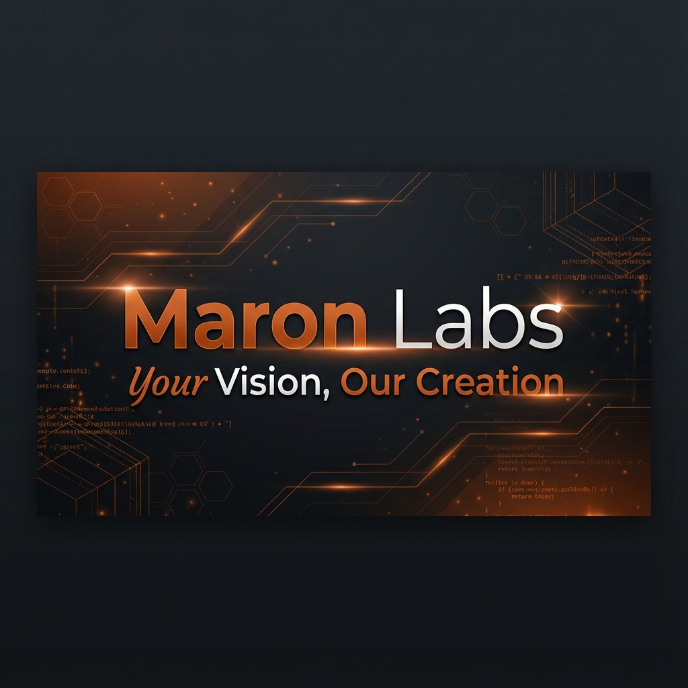

# Maron Labs - Digital Solutions Agency

A premium digital solutions agency website built with Next.js 15, React 19, and Tailwind CSS.



## 🚀 Features

- **Modern Tech Stack** - Next.js 15, React 19, TypeScript, Tailwind CSS
- **Responsive Design** - Mobile-first approach with beautiful UI across all devices
- **Scroll Animations** - Smooth fade-in, scale, and stagger animations using Intersection Observer
- **Page Loader** - Professional loading animation with progress bar
- **SEO Optimized** - Comprehensive metadata, Open Graph, Twitter cards, sitemap
- **Performance Focused** - Optimized images, font preloading, lazy loading

## 📄 Pages

- **Home** - Hero section, services carousel, testimonials, process overview
- **About** - Company story, vision/mission, core values, legal compliance
- **Services** - Comprehensive list of digital solutions offered
- **Portfolio** - Showcase of client projects with live links
- **Team** - Team member profiles and expertise
- **Contact** - Contact form, info cards, WhatsApp integration
- **Terms** - Terms of Service legal document
- **Privacy** - Privacy Policy legal document

## 🛠️ Tech Stack

- [Next.js 15](https://nextjs.org/) - React Framework
- [React 19](https://react.dev/) - UI Library
- [TypeScript](https://www.typescriptlang.org/) - Type Safety
- [Tailwind CSS](https://tailwindcss.com/) - Styling
- [Lucide Icons](https://lucide.dev/) - Icon Library
- [Vercel Analytics](https://vercel.com/analytics) - Analytics

## 🏃 Getting Started

### Prerequisites

- Node.js 18+ 
- npm or yarn

### Installation

```bash
# Clone the repository
git clone https://github.com/yourusername/maron-labs.git

# Navigate to the project
cd maron-labs

# Install dependencies
npm install

# Start development server
npm run dev
```

Open [http://localhost:3000](http://localhost:3000) to view the site.

## 📁 Project Structure

```
maron-labs/
├── app/                    # Next.js App Router pages
│   ├── about/             # About page
│   ├── contact/           # Contact page
│   ├── portfolio/         # Portfolio page
│   ├── privacy/           # Privacy Policy
│   ├── services/          # Services page
│   ├── team/              # Team page
│   ├── terms/             # Terms of Service
│   ├── layout.tsx         # Root layout
│   └── page.tsx           # Home page
├── components/
│   ├── sections/          # Page sections (hero, footer, etc.)
│   ├── navigation.tsx     # Main navigation
│   ├── scroll-animations.tsx  # Animation components
│   ├── page-loader.tsx    # Page loading component
│   └── ...
├── public/
│   ├── images/            # Static images
│   └── favicon/           # Favicon files
└── ...
```

## 🎨 Design System

### Colors
- **Primary**: `#cc5500` (Burnt Orange)
- **Secondary**: `#fee2b2` (Light Orange)
- **Dark**: `#161312`
- **Light**: `#f9f8f9`
- **Gray**: `#979696`

### Fonts
- **Headings**: Oswald
- **Script**: Yellowtail
- **Body**: League Spartan

## 📧 Contact

**Maron Labs**
- Email: hello@maronlabs.com
- Phone: +254 746 537 878
- Website: [www.maronlabs.com](https://www.maronlabs.com)
- Location: Nairobi, Kenya

## 📄 License

This project is proprietary software. See [LICENSE](LICENSE) for details.

---

**© 2024 Maron Labs. All Rights Reserved.**
